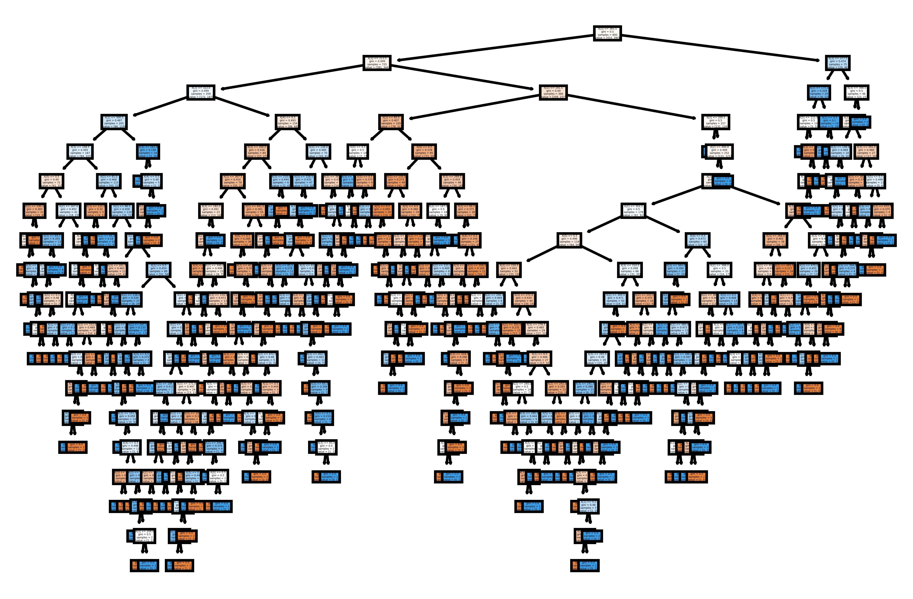

# Árovres de decisão geradas como resultados de testes de modelos preditivos

## Primeiro iteraçaõ de testes

## Segunda iteração de testes

## Terceira iteração de testes

## Teste com variáveis quantitativas substituindo qualitativas 
