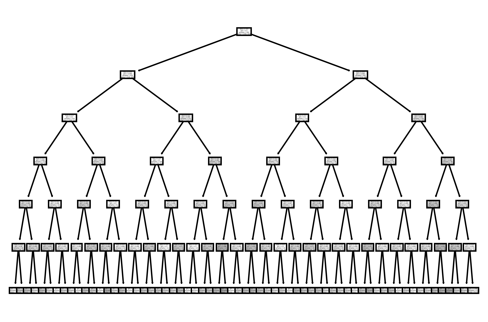

# Testes do modelo preditivo desenvolvido durante o TGI-I
##  Comparação de acurácia de modelo preditivos, com base nas variáveis utilizadas na tupla de treinamento
### Primeira iteração de testes
#### 1.1 Teste de Controle
Nesse teste, utilizou-se a seguinte tupla contendo todas as variáveis, gerando a figura 1:
"patologia_vascular","etilismo", "glicemia_elevada","peso_maior_80”,"colesterol_alto", "sedentarismo"
Figura 1:

Acurácia: 0.50; Raiz da árvore: colesterol_alto

#### 1.2 Teste sem variável sedentarismo
Nesse teste, retirou-se da tupla variável preditiva sedentarismo; foi utilizada a seguinte tupla, gerando a figura 2: 
"patologia_vascular","etilismo","glicemia_elevada","peso_maior_80","colesterol_alto"
Figura 2:
.png "Teste 1.2 - Sem variável sedentarismo")
Acurácia: 0.48; Raiz da árvore: colesterol_alto

#### 1.3 Teste sem variável colesterol_alto
Nesse teste, retirou-se da tupla variável preditiva colesterol_alto; foi utilizada a seguinte tupla, gerando a figura 3:
"patologia_vascular","etilismo","glicemia_elevada","peso_maior_80","sedentarismo"
Figura 3:
.png "Teste 1.3 - Sem variável colesterol_alto")
Acurácia: 0.535; Raiz da árvore: patologia_vascular

#### 1.4 Teste sem variável peso_maior_80
Nesse teste, retirou-se da tupla variável preditiva peso_maior_80; foi utilizada a seguinte tupla, gerando a figura 4:
"patologia_vascular","etilismo","glicemia_elevada","coleterol_alto","sedentarismo"
Figura 4:
.png "Teste 1.4 - Sem variável peso_maior_80")
Acurácia: 0.455; Raiz da árvore: Variável colesterol_alto

#### 1.5 Teste sem variável glicemia_elevada
Nesse teste, retirou-se da tupla variável preditiva glicemia_elevada; foi utilizada a seguinte tupla, gerando a figura 5:
"patologia_vascular","etilismo","peso_maior_80","coleterol_alto","sedentarismo"
Figura 5:
.png "Teste 1.5 - Sem variável glicemia_elevada")
Acurácia: 0.44; Raiz da árvore: colesterol_alto

#### 1.6 Teste sem variável etilismo
Nesse teste, retirou-se da tupla variável preditiva etilismo; foi utilizada a seguinte tupla, gerando a figura 6:
"patologia_vascular","glicemia_elevada","peso_maior_80","coleterol_alto","sedentarismo"
Figura 6:
.png "Teste 1.6 - Sem variável etilismo")
Acurácia: 0.525 Raiz da árvore: colesterol_alto

#### 1.7 Teste sem variável patologia_vascular
Nesse teste, retirou-se da tupla variável preditiva patologia_vascular; foi utilizada a seguinte tupla, gerando a figura 7:
"etilismo", "glicemia_elevada","peso_maior_80","coleterol_alto", "sedentarismo"
Figura 7:
.png "Teste 1.7 - Sem variável patologia_vascular")
Acurácia: 0.495; Raiz da árvore: colesterol_alto

### Segunda iteração de testes
Removendo a variável colesterol_alto, obteve-se um aumento de 0.035 na acurácia. Maior pontuação durante a primeira iteração. 

#### 2.1 Teste sem variáveis colesterol_alto e sedentarismo
Nesse teste, retirou-se da tupla as variáveis preditivas colesterol_alto e sedentarismo; foi utilizada a seguinte tupla, gerando a figura 8:
"patologia_vascular","etilismo","glicemia_elevada","peso_maior_80"
Figura 8:
.png "Teste 2.1 - Sem variáveis colesterol_alto e sedentarismo")
Acurácia: 0.51; Raiz da árvore: patologia_vascular

#### 2.2 Teste sem variáveis colesterol_alto e peso_maior_80
Nesse teste, retirou-se da tupla as variáveis preditivas colesterol_alto e peso_maior_80; foi utilizada a seguinte tupla, gerando a figura 9:
"patologia_vascular","etilismo","glicemia_elevada","sedentarismo"
Figura 9:
.png "Teste 2.2 - Sem variáveis colesterol_alto e peso_maior_80")
Acurácia: 0.53; Raiz da árvore: patologia_vascular

#### 2.3 Teste sem variáveis colesterol_alto e glicemia_elevada
Nesse teste, retirou-se da tupla as variáveis preditivas colesterol_alto e glicemia_elevada; foi utilizada a seguinte tupla, gerando a figura 10:
"patologia_vascular","etilismo","peso_maior_80","sedentarismo"
Figura 10:
.png "Teste 2.3 - Sem variáveis colesterol_alto e glicemia_elevada")
Acurácia: 0.545; Raiz da árvore: patologia_vascular

#### 2.4 Teste sem variáveis colesterol_alto e etilismo
Nesse teste, retirou-se da tupla as variáveis preditivas colesterol_alto e etilismo; foi utilizada a seguinte tupla, gerando a figura 11:
"patologia_vascular","glicemia_elevada","peso_maior_80","sedentarismo"
Figura 11:
.png "Teste 2.4 - Sem variáveis colesterol_alto e glicemia_etilismo")
Acurácia: 0.495; Raiz da árvore: patologia_vascular

#### 2.5 Teste sem variáveis colesterol_alto e patologia_vascular
Nesse teste, retirou-se da tupla as variáveis preditivas colesterol_alto e patologia_vascular; foi utilizada a seguinte tupla, gerando a figura 12:
"etilismo","glicemia_elevada","peso_maior_80","sedentarismo"
Figura 12:
.png "Teste 2.5 - Sem variáveis colesterol_alto e patologia_vascular")
Acurácia: 0.565; Raiz da árvore: peso_maior_80

### Terceira iteração de testes
Removendo as variáveis colesterol_alto e patologia_vascular obteve-se um aumento de 0.065 na acurácia. Maior pontuação durante a segunda iteração. 
#### 3.1 Teste sem variáveis colesterol_alto, patologia_vascular e sedentarismo
Nesse teste, retirou-se da tupla as variáveis preditivas colesterol_alto, patologia_vascular e sedentarismo; foi utilizada a seguinte tupla, gerando a figura 13:
"etilismo","glicemia_elevada","peso_maior_80"
Figura 13:
.png "Teste 3.1 - Sem variáveis colesterol_alto, patologia_vascular e sedentarismo")
Acurácia: 0.515; Raiz da árvore: sedentarismo

#### Teste sem variáveis colesterol_alto, patologia_vascular e glicemia_elevada
Nesse teste, retirou-se da tupla as variáveis preditivas colesterol_alto, patologia_vascular e glicemia_elevada; foi utilizada a seguinte tupla, gerando a figura 14:
"etilismo","peso_maior_80","sedentarismo"
Figura 14:
.png "Teste 3.2 - Sem variáveis colesterol_alto, patologia_vascular e glicemia_elevada")
Acurácia: 0.535; Raiz da árvore: peso_maior_80

#### Teste sem variáveis colesterol_alto, patologia_vascular e etilismo
Nesse teste, retirou-se da tupla as variáveis preditivas colesterol_alto, patologia_vascular e etilismo; foi utilizada a seguinte tupla, gerando a figura 15:
"glicemia_elevada","peso_maior_80","sedentarismo"
Figura 15:
.png "Teste 3.3 - Sem variáveis colesterol_alto, patologia_vascular e etilismo")
Acurácia: 0.55; Raiz da árvore: peso_maior_80

*Como não ouve melhora nos 3 últimos testes, declarou-se esse experimento como encerrado. A maior acurácia encontrada durantes os testes foi de 0.565, obtido após se remover as 2 variáveis: patologia_vascular e colesterol_alto.*

## 4 Teste com variáveis quantitativas substituindo qualitativas 
Substituição de variáveis categóricas em modelos preditivos de árvores de decisão, gerando a figura 16. Utilizou-se a seguinte tupla
"patologia_vascular","etilismo", "glicemia","peso”,"colesterol_alto", "sedentarismo"
Figura 16:

Acurácia 0.495; Raiz da árvore: Glicemia
